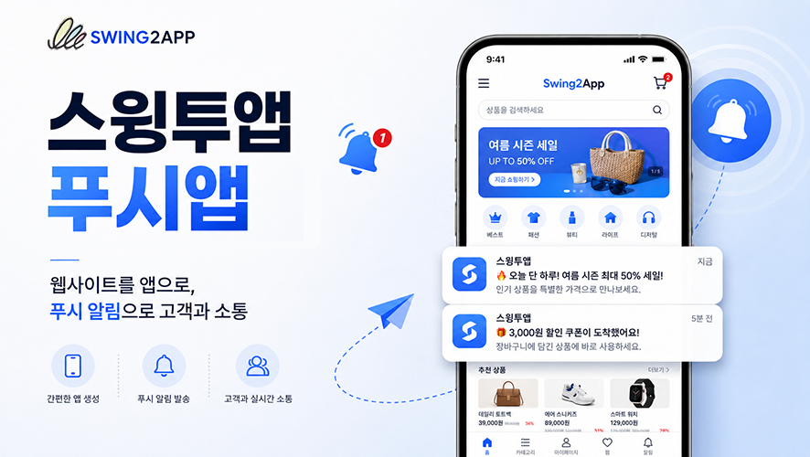
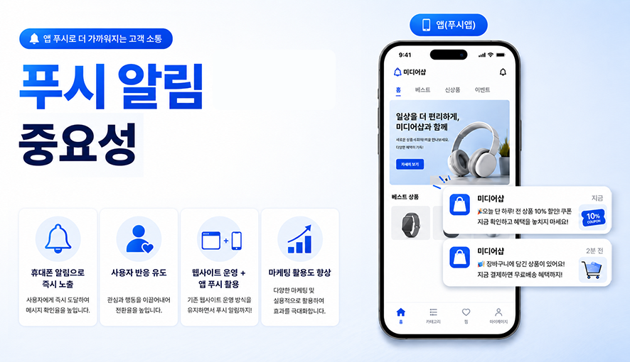
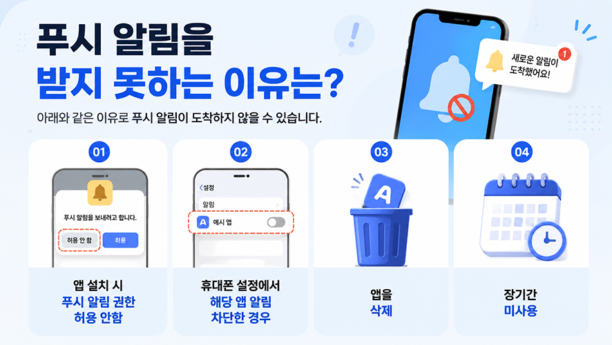
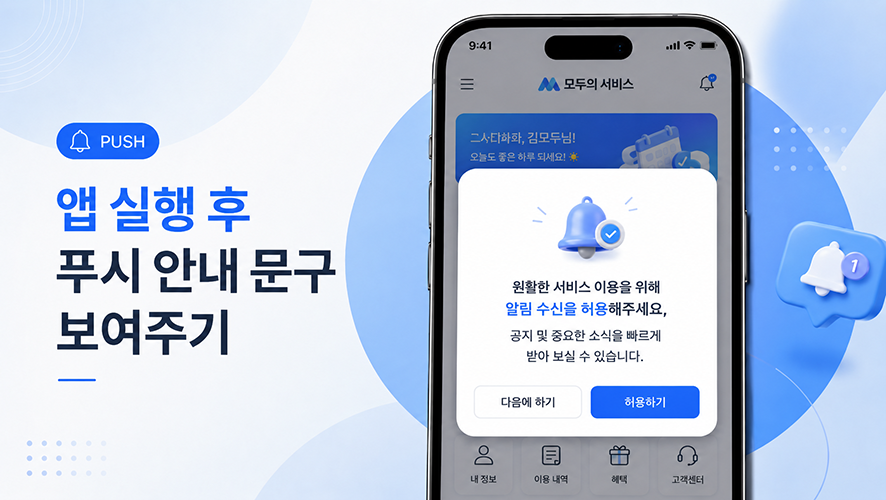
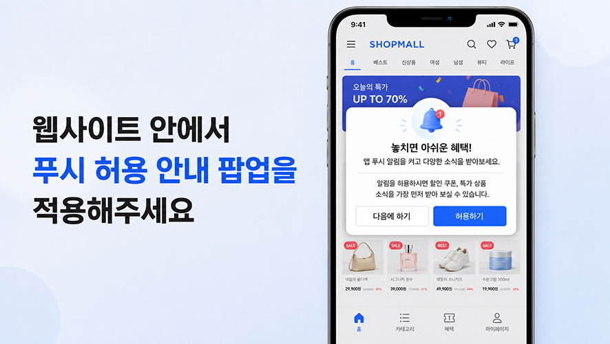
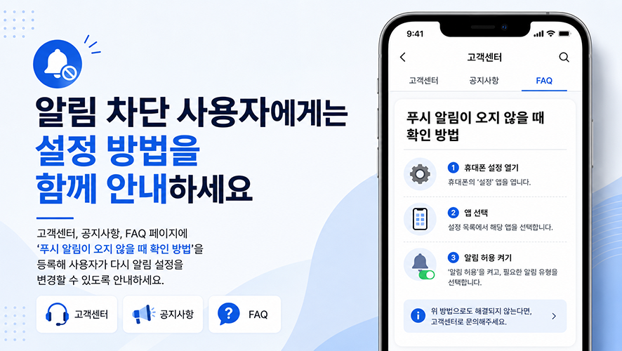
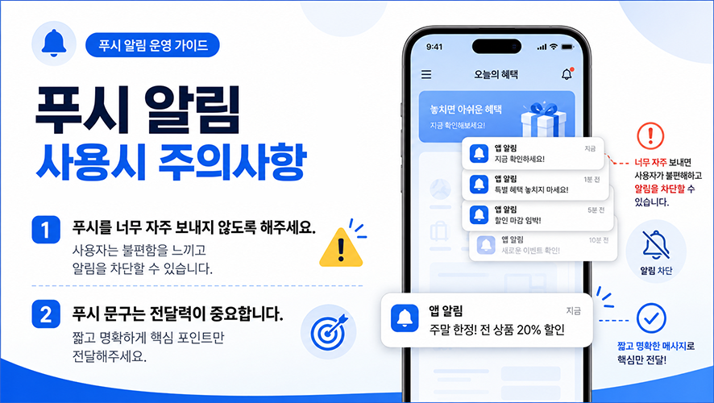
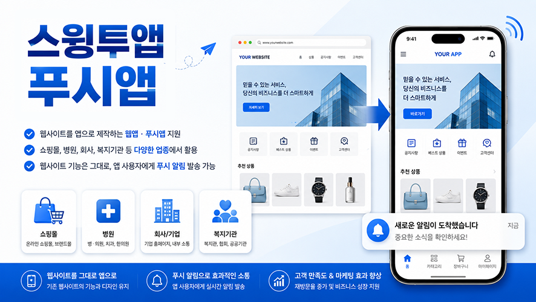

# 푸시 마케팅 전략

***

**푸시 알림, 더 많이 받게 만드는 마케팅 전략**

앱을 운영할 때 푸시 매우 중요한 마케팅 수단입니다.

이벤트 안내, 공지사항, 쿠폰 발송, 예약 알림, 업데이트 소식 등 다양한 정보를 사용자에게 빠르게 전달할 수 있기 때문입니다.

특히 쇼핑몰, 커뮤니티, 교육, 병원, 복지기관, 예약 서비스처럼 사용자에게 반복적으로 소식을 전달해야 하는 서비스라면 푸시 알림은 앱 운영에 꼭 필요한 기능이라고 볼 수 있습니다.

하지만 푸시 알림은 사용자가 앱에서 알림을 허용해야 정상적으로 받을 수 있습니다.

사용자가 처음 앱을 설치한 뒤 알림 권한을 거부하거나, 휴대폰 설정에서 앱 알림을 차단하면 이후 발송되는 푸시 메시지를 받을 수 없습니다.

따라서 앱 운영자는 단순히 푸시를 발송하는 것뿐 아니라, 더 많은 사용자가 푸시 알림을 받을 수 있도록 안내하고 유도하는 전략도 함께 준비해야 합니다.

이번 포스팅에서는 앱 푸시 마케팅에 대해서 알려드리겠습니다.

<figure><figcaption></figcaption></figure>

***

## **1. 푸시 알림은 왜 중요한가요?**

푸시 알림은 앱을 실행하지 않은 사용자에게도 직접 메시지를 전달할 수 있는 기능입니다.

예를 들어 다음과 같은 상황에서 활용할 수 있습니다.

* 신규 이벤트 및 프로모션 안내
* 쇼핑몰 할인 쿠폰 발송
* 공지사항 및 긴급 안내
* 예약, 신청, 접수 관련 알림
* 콘텐츠 업데이트 안내
* 회원 대상 맞춤형 소식 전달

웹사이트나 이메일은 사용자가 직접 접속하거나 확인해야 하지만, 앱 푸시는 휴대폰 알림으로 바로 노출되기 때문에 사용자 반응을 유도하기 좋습니다.

특히 웹사이트를 앱으로 제작한 웹앱, 푸시앱의 경우 기존 웹사이트 운영 방식은 유지하면서 앱 사용자에게 푸시 알림까지 보낼 수 있어 마케팅 활용도가 높습니다.

<figure><figcaption></figcaption></figure>

***

## **2. 푸시 알림을 받지 못하는 대표적인 이유**

앱에서 푸시를 발송했는데 일부 사용자가 알림을 받지 못하는 경우가 있습니다.

이때 가장 흔한 원인은 사용자의 알림 설정입니다.

대표적인 원인은 다음과 같습니다.

1. **앱 설치 시 푸시 알림 권한을 허용하지 않은 경우**
2. **휴대폰 설정에서 해당 앱의 알림을 차단한 경우**
3. **앱을 삭제했거나 장기간 실행하지 않은 경우**
4. **기기 설정에서 방해금지 모드 또는 알림 제한 기능을 사용 중인 경우**
5. **네트워크 상태나 OS 정책에 따라 알림 수신이 지연되는 경우**

이 중 가장 중요한 부분은 사용자가 직접 알림을 차단한 경우입니다.

이 경우 앱 운영자가 푸시를 발송하더라도 해당 사용자에게는 알림이 도착하지 않습니다.

<mark style="color:$primary;">**👉스윙투앱 푸시 이용시에도, 실제 앱 설치 수 보다 푸시 발송 수가 적은 이유도 이러한 이유 때문이에요.**</mark>

<mark style="color:$primary;">**앱을 설치해도 앱의 푸시 알림을 차단하거나, 알림 권한을 허용하지 않을 경우 사용자 기기로 푸시가 전송되지 않습니다.**</mark>&#x20;

따라서 앱 운영 시에는 사용자에게 푸시 알림을 허용해야 하는 이유를 자연스럽게 안내하는 것이 중요합니다.

<figure><figcaption></figcaption></figure>

***

## **3. 앱 설치 직후 안내 문구를 활용하세요**

처음 앱을 설치하면 보통 OS 알림 권한 요청창이 뜹니다.

사용자가 푸시 알림의 필요성을 이해한 상태에서 허용 버튼을 누를 수 있습니다.

<figure><figcaption></figcaption></figure>

만약 그냥 지나친 경우에도 사용자가 앱 상에서 푸시 알림 허용 안내 팝업을 노출시키는 것도 좋은 방법입니다.

다만 너무 강제적인 표현보다는 사용자에게 필요한 정보라는 점을 부드럽게 전달하는 것이 좋습니다.

예시 문구는 다음과 같습니다.

“중요한 소식을 놓치지 않도록 푸시 알림을 허용해주세요.”

“앱 알림을 허용하시면 이벤트, 공지사항, 업데이트 소식을 빠르게 받아보실 수 있습니다.”

“원활한 서비스 이용을 위해 알림 수신을 허용해주세요.”

<figure><figcaption></figcaption></figure>

***

## **4. 웹사이트 안에서도 푸시 허용 안내 팝업을 보여주세요.**

웹사이트를 앱으로 제작한 웹앱 방식의 경우, 앱 화면 안에서 웹사이트 콘텐츠가 그대로 표시됩니다.

**💡푸시앱 이용자분들은**&#x20;

**웹사이트 영역에 별도의 안내 팝업이나 배너를 띄워 사용자에게 푸시 알림 허용을 유도해주세요!**

예를 들어 웹사이트 메인 화면, 마이페이지, 이벤트 페이지 등에 다음과 같은 문구를 노출할 수 있습니다.

<mark style="color:violet;">“푸시 알림을 허용하시면 중요한 공지와 이벤트 소식을 빠르게 받아보실 수 있습니다.”</mark>

<mark style="color:violet;">“앱 알림이 꺼져 있으면 쿠폰, 이벤트, 공지사항을 받을 수 없습니다. 알림을 허용해주세요.”</mark>

<mark style="color:violet;">“놓치면 아쉬운 혜택! 앱 푸시 알림을 켜고 다양한 소식을 받아보세요.”</mark>

웹 콘텐츠 영역에서도 사용자에게 반복적으로 안내할 수 있다는 장점이 있습니다.

특히 사용자가 앱 알림을 차단한 경우에는 앱 푸시가 도착하지 않기 때문에,

**👉사용자가 앱을 실행했을 때 웹 팝업이나 배너를 통해 다시 한번 알림 설정을 안내하는 방식이 효과적입니다.**

<figure><figcaption></figcaption></figure>

***

## **5. 알림 차단 사용자에게는 설정 방법을 함께 안내하세요**

사용자가 이미 휴대폰 설정에서 앱 알림을 차단한 경우에는 단순한 문구만으로는 알림 수신이 다시 활성화되지 않을 수 있습니다.

이때는 사용자가 직접 알림 설정을 변경할 수 있도록 안내해야 합니다.

**\*예시 안내 문구**

<mark style="color:violet;">“현재 앱 알림이 꺼져 있을 수 있습니다.</mark>&#x20;

<mark style="color:violet;">휴대폰 설정에서 앱 알림을 허용하시면 공지사항과 이벤트 소식을 받아보실 수 있습니다.”</mark>

또는 다음과 같이 안내할 수 있습니다.

<mark style="color:violet;">“알림을 받지 못하고 계신가요? 휴대폰 설정 > 앱 > 앱 이름 > 알림 허용을 켜주세요.”</mark>

아이폰과 안드로이드는 설정 경로가 다를 수 있으므로, 앱 운영자는 사용자에게 OS별 알림 설정 방법을 별도로 안내하는 것도 좋습니다.

👉예를 들어 **고객센터, 공지사항, FAQ 페이지에 “푸시 알림이 오지 않을 때 확인 방법”을 등록해두면 사용자가 직접 문제를 해결하는 데 도움이 됩니다.**

<figure><figcaption></figcaption></figure>

***

## 6. 푸시 알림 사용시 주의사항

**1)너무 잦은 푸시는 오히려 알림 차단으로 이어질 수 있습니다**

푸시 알림은 효과적인 마케팅 수단이지만, 너무 자주 보내면 사용자가 불편함을 느끼고 앱 알림을 차단할 수 있습니다.

실제로도 앱 사용자에게 설문조사를 한 결과 너무 많은 푸시 알림으로 푸시 알림을 꺼두었다는 답변이 많았습니다.

따라서 푸시 발송 시에는 발송 빈도와 내용을 신중하게 관리해야 합니다.

특히 광고성 메시지만 반복해서 보내기보다는 사용자에게 실제로 도움이 되는 정보, 혜택, 공지사항을 함께 구성하는 것이 좋습니다.

예를 들어 쇼핑몰 앱이라면 매일 같은 할인 문구를 반복하는 것보다, 신상품 안내, 한정 쿠폰, 배송 공지, 시즌 이벤트 등을 적절히 나누어 발송하는 것이 좋습니다.

사용자가 “이 앱의 알림은 필요한 정보가 온다”고 느끼게 만드는 것이 장기적으로 푸시 수신률을 유지하는 핵심입니다.

**2)푸시 문구는 짧고 명확하게 작성하세요**

푸시 알림은 휴대폰 화면에 짧게 표시되기 때문에 문구가 너무 길면 전달력이 떨어질 수 있습니다.

좋은 푸시 문구는 다음과 같은 특징이 있습니다.

-핵심 내용이 바로 보인다

-사용자가 눌러야 할 이유가 있다

-너무 자주 보내지 않는다

-광고성 문구만 반복하지 않는다

-공지, 혜택, 정보성 메시지를 적절히 섞는다

예를 들어 단순히 “이벤트 안내”라고 보내는 것보다,

**👉“오늘 하루만 사용 가능한 10% 할인 쿠폰이 도착했습니다.”**

처럼 구체적인 혜택을 전달하는 것이 더 효과적입니다.

또한 공지성 푸시의 경우에는

**👉“5월 서비스 점검 일정 안내드립니다.”**

처럼 사용자가 바로 이해할 수 있는 제목을 사용하는 것이 좋습니다.

<figure><figcaption></figcaption></figure>

***

## **7. 푸시 마케팅은 “발송”보다 “수신 환경 만들기”가 중요**

푸시 마케팅을 효과적으로 운영하려면 단순히 메시지를 많이 보내는 것만으로는 부족합니다.

중요한 것은 더 많은 사용자가 푸시를 받을 수 있도록 알림 허용을 유도하고, 푸시를 차단하지 않도록 유용한 메시지를 보내는 것입니다.

정리하면 다음과 같습니다.

* **앱 설치 직후 푸시 알림 허용 이유를 안내하기**
* **앱 내 웹 팝업이나 배너로 알림 허용을 다시 안내하기**
* **알림 차단 사용자를 위해 설정 방법 안내하기**
* **사용자에게 필요한 정보와 혜택 중심으로 푸시 발송하기**
* **너무 잦은 광고성 푸시는 피하기**
* **공지, 이벤트, 쿠폰, 업데이트 소식을 적절히 구성하기**

그리고 더 많은 사용자가 푸시를 받도록 하려면,

사용자가 알림을 허용할 만한 이유를 명확하게 알려줘야 합니다.

단순히 “알림을 허용해주세요”라고 안내하는 것보다, 사용자가 어떤 혜택을 받을 수 있는지 함께 설명하는 것이 좋습니다.

예를 들어 쇼핑몰 앱이라면 다음과 같이 안내할 수 있습니다.

<mark style="color:violet;">👉“알림을 허용하시면 할인 쿠폰, 특가 상품, 이벤트 소식을 가장 먼저 받아보실 수 있습니다.”</mark>

교육 앱이라면 다음과 같이 안내할 수 있습니다.

<mark style="color:violet;">👉“알림을 허용하시면 수업 일정, 과제 안내, 공지사항을 놓치지 않고 확인하실 수 있습니다.”</mark>

복지기관이나 공공기관 앱이라면 다음과 같이 안내할 수 있습니다.

<mark style="color:violet;">👉“알림을 허용하시면 새로운 복지 정보와 중요한 공지사항을 빠르게 확인하실 수 있습니다.”</mark>

이처럼 앱의 목적에 맞게 푸시 알림의 필요성을 설명하면 사용자가 알림을 허용할 가능성이 높아집니다.

앱 푸시는 고객과 다시 연결될 수 있는 중요한 채널입니다.

<figure><figcaption></figcaption></figure>

스윙투앱에서는 웹사이트를 앱으로 제작하는 웹앱, 푸시앱 제작을 지원합니다.

이미 운영 중인 홈페이지, 쇼핑몰, 커뮤니티, 예약 사이트, 기관 홈페이지가 있다면 해당 웹사이트를 앱으로 연결하고, 앱 사용자에게 푸시 알림을 발송할 수 있습니다.

앱 사용자에게 푸시 알림을 발송하며 더 적극적인 고객 소통과 마케팅 운영이 가능합니다.

