# 푸시앱-메뉴 리스트 수정 방법

***

**메뉴(Menu)는 무엇인가요? 어떻게 수정 혹은 제거 할 수 있나요?**

메뉴(Menu)는 푸시 툴바에서 제공되는 기능이며, 푸시앱 제작시 기본 셋팅 기능으로 제공이 되고 있습니다.

푸시앱의 경우 툴바가 제공되는데요. 앱에 연결해놓은 웹사이트 외에 추가 마케팅 채널 및 기능을 보여주고자 할 때 활용할 수 있습니다.

예를들어 쇼핑몰 사이트라면 마케팅 채널 - 인스타그램, 카카오톡 채널 등을 추가로 연동할 수 있구요.

이벤트 페이지, 공지사항 게시판 등을 연결하여 사용할 수 있습니다.



이미지 참고)

<figure>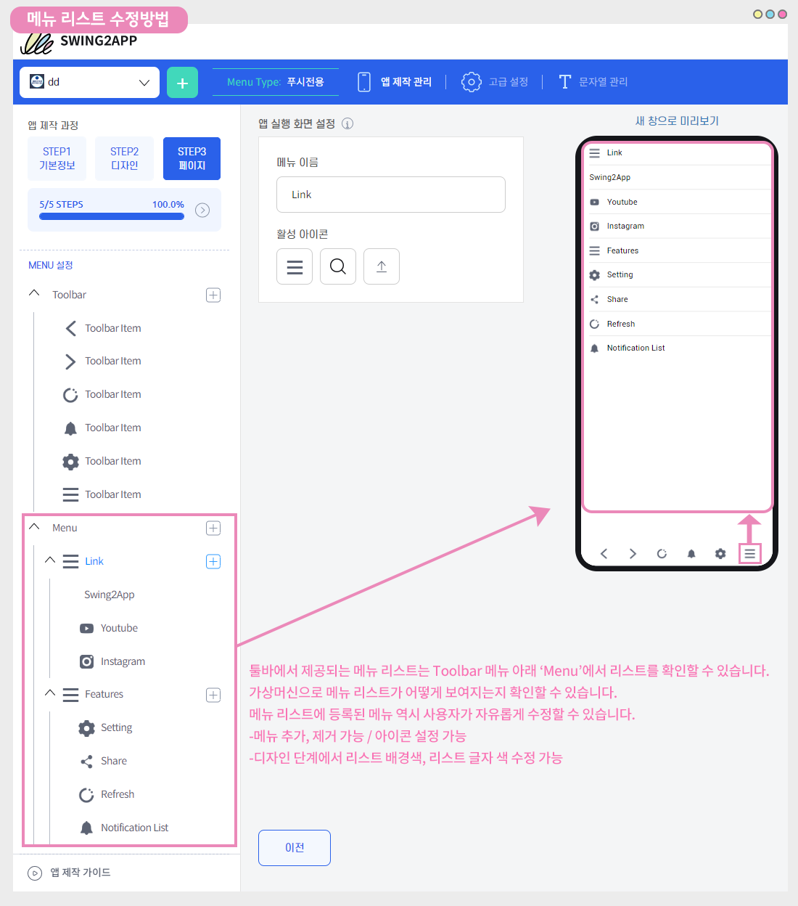<figcaption></figcaption></figure>

웹 미리보기(가상머신)에서 보시는 것처럼 메뉴 툴바에는 스윙투앱, 유튜브, 인스타그램 등 이러한 기능들이 자동으로 셋팅되어 있습니다.

사용자의 편의에 따라 사용하지 않아도 되고, 사용할 경우 다양한 기능들로 구성 메뉴를 변경 및 편집해서 이용할 수 있습니다.

**1)메뉴(Menu) 사용 하지 않을 경우 \*삭제**

<figure>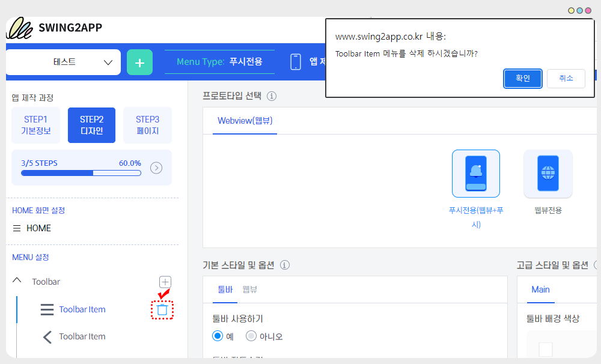<figcaption></figcaption></figure>

메뉴(Menu) 자체를 사용하지 않는다면 제거해주시면 됩니다.

툴바 메뉴에 마우스 커서를 가져다대면 휴지통 모양의 아이콘이 보여집니다.

해당 아이콘 선택시 메뉴를 삭제하시겠습니까 메시지가 뜨구요. 확인을 누르면 제거됩니다.

\*제거 후 저장 까지 꼭 선택해주세요.

**2)메뉴 편집**

메뉴(Menu)를 사용하고, 메뉴 내에 제공되는 페이지(기능)을 수정한다면 아래 매뉴얼에서 알려드리는 방법으로 진행해주세요.

<figure>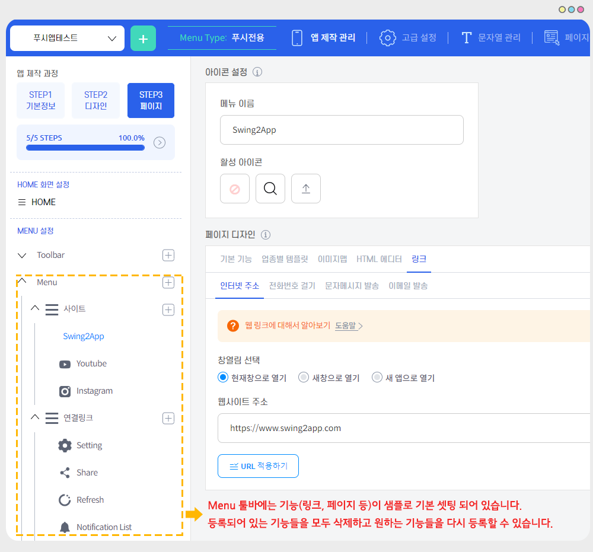<figcaption></figcaption></figure>

MENU설정 아래에 보시면 Toolba와 Menu가 있습니다.

\*수정은 Menu를 열어서 작업해주세요.

Menu에는 기능들이 샘플로 셋팅 되어 있습니다.

등록되어 있는 기능들을 모두 삭제하고 적용하길 원하는 기능들을 등록하여 저장해주시면 됩니다.

**전체적인 툴바 메뉴 이용방법은 아래 매뉴얼로 확인해주세요.**



***



## 1.툴바 메뉴 수정(편집) 방법

앱 실행화면) 푸시앱 툴바 메뉴

<figure>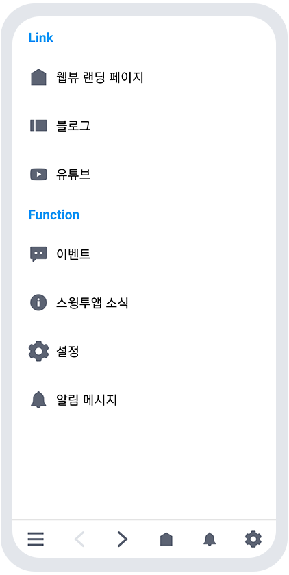<figcaption></figcaption></figure>

푸시앱 메뉴 화면을 캡쳐한 화면이구요. 해당 메뉴처럼 기능들을 넣어볼게요.

### 1)연결된 메뉴 삭제하기

먼저 등록된 메뉴를 모두 삭제할게요.

<figure><figcaption></figcaption></figure>

삭제하고자 하는 메뉴에 마우스 커서를 가져다대면 휴지통 모양의 아이콘이 보여집니다.

해당 아이콘 선택시 메뉴를 삭제하시겠습니까 메시지가 뜨구요. 확인을 누르면 제거됩니다.

\*제거 후 저장 까지 꼭 선택해주세요

### **2)메뉴 추가하기**

<figure>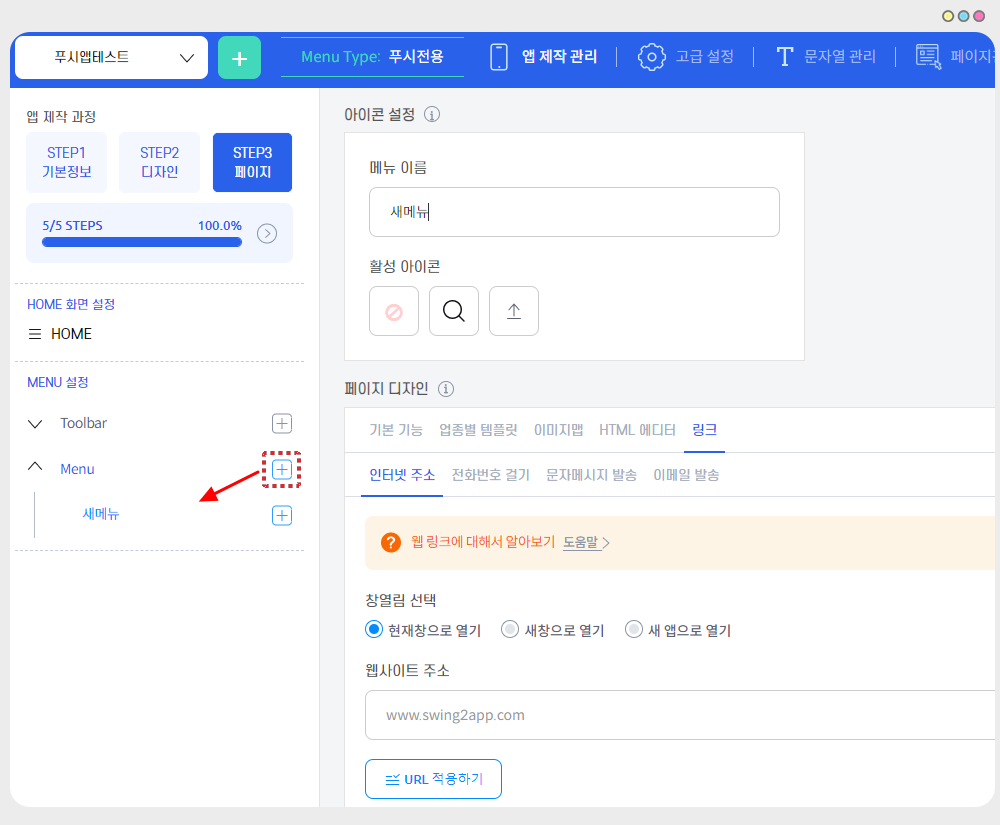<figcaption></figcaption></figure>

\+ 모양 아이콘을 누르면 새 메뉴가 생성됩니다.

해당 방법으로 메뉴들을 추가할 수 있습니다.

### 3)웹링크(인터넷 주소) 적용하기

<figure>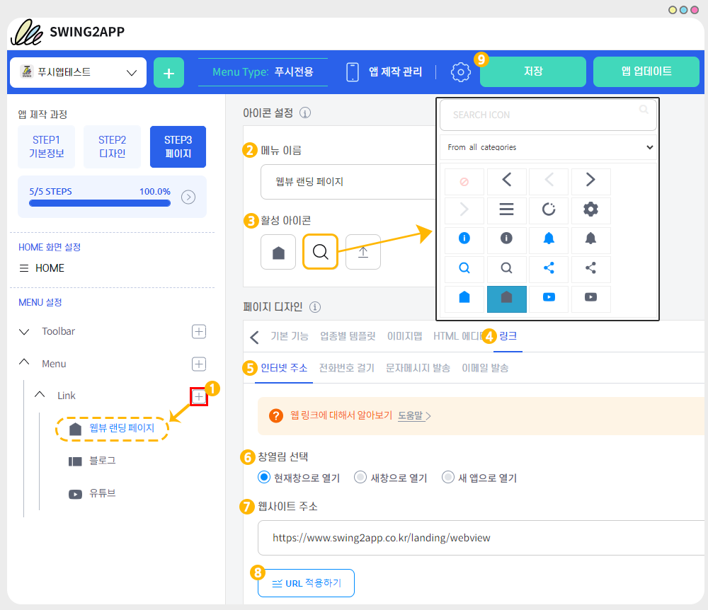<figcaption></figcaption></figure>

웹링크는 가장 많이 활용할 수 있는 기능 중 하나이구요.

마케팅 채널(유튜브, 인스타그램, 페이스북 등)의 URL 주소를 넣을 수 있습니다.

(1)+ 아이콘 선택해서 새 매뉴 추가 후

(2)메뉴 이름 입력

(3)활성 아이콘 선택

\*아이콘은 선택 입력입니다. 텍스트만 입력하실 경우 해당 항목은 넘어가주세요.

\-아이콘 등록은 돋보기 모양 아이콘 클릭시, 아이콘을 선택할 수 있습니다.

다른 이미지를 이용하고 싶다면 마지막 업로드 버튼을 선택해서 아이콘 이미지를 등록해서 사용 가능합니다.

(4)페이지 디자인: 링크 선택

(5)인터넷 주소 선택

(6)창열림 선택 : 유튜브, 인스타그램 등 외부 앱으로 열리는 링크 등은 " 새 앱으로 열기"로 체크해주세요.

(7)웹사이트 주소 입력 입력 \*http:// 하이퍼링크 꼭 넣어주세요

(8)URL 적용하기 버튼 선택

(9)저장 버튼 선택

### 4)이미지맵 적용하기

<figure>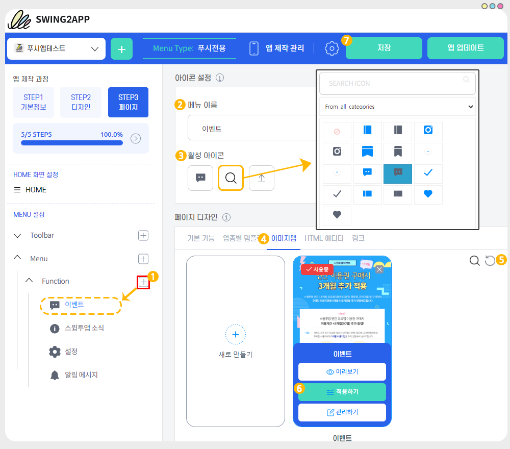<figcaption></figcaption></figure>

다음은 이벤트 페이지로, 이벤트 홍보 이미지를 이미지맵으로 적용하여 등록하겠습니다.

<mark style="color:red;">\*주의\*</mark>

이미지맵을 먼저 등록해주셔야 합니다. \[새로 만들기] 버튼을 선택해서 연결할 이미지 페이지를 먼저 만들어주세요.

(1)+ 아이콘 선택해서 새 매뉴 추가 후

(2)메뉴 이름 입력

(3)활성 아이콘 선택

\*아이콘은 선택 입력입니다. 텍스트만 입력하실 경우 해당 항목은 넘어가주세요.

\-아이콘 등록은 돋보기 모양 아이콘 클릭시, 아이콘을 선택할 수 있습니다.

다른 이미지를 이용하고 싶다면 마지막 업로드 버튼을 선택해서 아이콘 이미지를 등록해서 사용 가능합니다.

(4)페이지 디자인: 이미지맵 선택

(5)새로고침 버튼 선택

(6)이미지 페이지 선택 후 적용하기 버튼 선택해주세요.

이미지 페이지에 마우스 커서를 올려다 놓으면 적용하기 버튼이 열립니다.

(7)저장 버튼 선택

소개해드린 기능 외에도 템플릿 페이지, 에디터 페이지 등의 기능을 연결할 수 있구요.

툴바 기본 기능: 북마크 리스트, 메뉴, 알림목록, 설정 등의 기능도 적용할 수 있습니다.

***

## 2.앱 실행화면

<figure><figcaption></figcaption></figure>

<figure><figcaption></figcaption></figure>

푸시앱 툴바 메뉴에 연결된 기능들을 확인한 화면입니다.

모든 메뉴들이 연결된 기능 및 페이지로 잘 연결이 되어 구동됨을 확인할 수 있습니다.

***

## 3.응용1) 리스트 아이콘 이미지 변경

기본 셋팅 아이콘 외에 다른 이미지를 아이콘으로 등록하는 방법입니다.

### 1)앱 실행화면

<figure>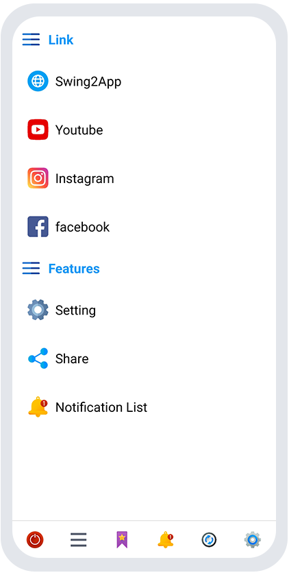<figcaption></figcaption></figure>

기본 제공되는 아이콘 이미지 외에, 다른 이미지를 업로드하여 툴바 리스트아이콘을 꾸밀 수 있습니다.

### 2)아이콘 이미지 등록하기

<figure>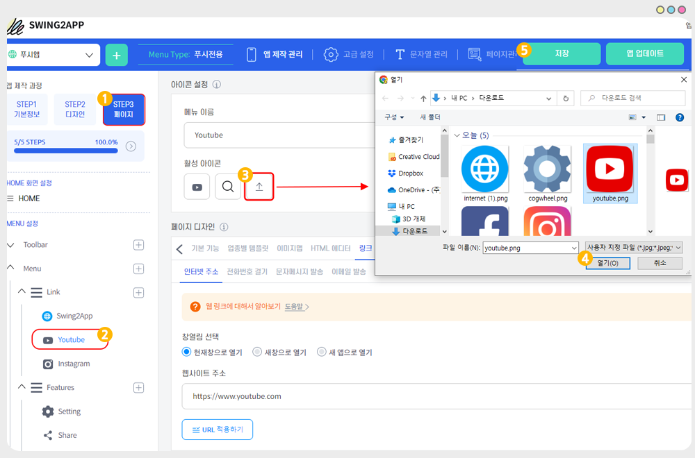<figcaption></figcaption></figure>

(1)STEP3 페이지

(2)아이콘 적용할 메뉴 선택

(3) 아이콘에서 세번째 업로드 버튼을 선택해주세요.

(4)파일 첨부창에서 등록하고자 하는 이미지를 선택해서 열기 해주세요.

(5)상단 \[저장] 버튼을 선택해주세요.


아이콘 이미지 사이즈

최소 사이즈 51px \~ 최대 사이즈 512px 사이의 정사각형 이미지를 등록해주세요.

반드시 가로\*세로 길이가 동일한 정사각형으로 넣어주셔야 합니다.

예시) 512px \* 512px


\*해당 기능은 저장만 하면 반영되어, 업데이트가 필요 없습니다.

앱을 완전히 종료 후, 재실행하면 변경된 아이콘 이미지를 확인할 수 있습니다.



***

## 4.응용2) 메뉴 리스트 글자 색상 수정

메뉴 리스트의 글자 색상을 수정 하는 방법입니다.

### 1)앱 실행화면

<figure>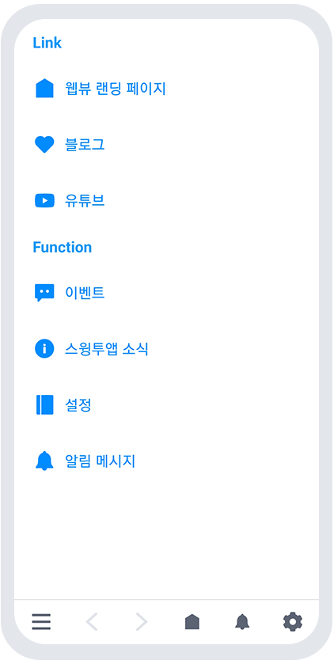<figcaption></figcaption></figure>

앱 실행화면에 보시는 것처럼, 리스트에 보여지는 글자 색상을 변경할 수 있습니다.

컨셉에 맞게 색상을 수정해서 사용할 수 있습니다.

<mark style="color:orange;">주의) 아이콘 이미지는 색상 변경이 안됩니다. 아이콘 색상과 동일한 글자색으로 맞추었습니다.</mark>

### 2)메뉴 리스트 텍스트 색상 변경하기

<figure>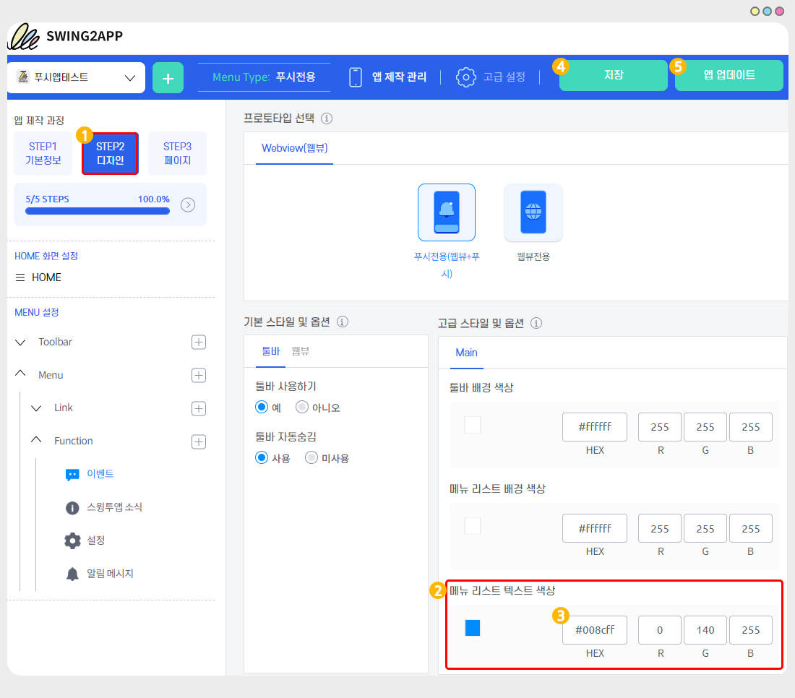<figcaption></figcaption></figure>

1\)앱제작 -STEP2디자인 선택

2\)고급 스타일 및 옵션: 메뉴 리스트 텍스트 색상 선택

3\)적용하고자 하는 색상을 입력합니다.

HEX 값을 직접 입력하거나, 색상 버튼을 선택해서 원하는 색상을 핀으로 선택해도 됩니다.

<figure><figcaption></figcaption></figure>

4\)저장 버튼 선택

5\)앱 업데이트 버튼을 선택해주세요.

\*해당 기능 적용은 앱 업데이트가 필요합니다. 글자 색상 변경 후 저장 및 앱 업데이트를 해주세요.

스토어에 출시된 앱은 해당 스토어에 새로 제작된 버전의 앱으로 업데이트 해주셔야 반영됩니다.



***

