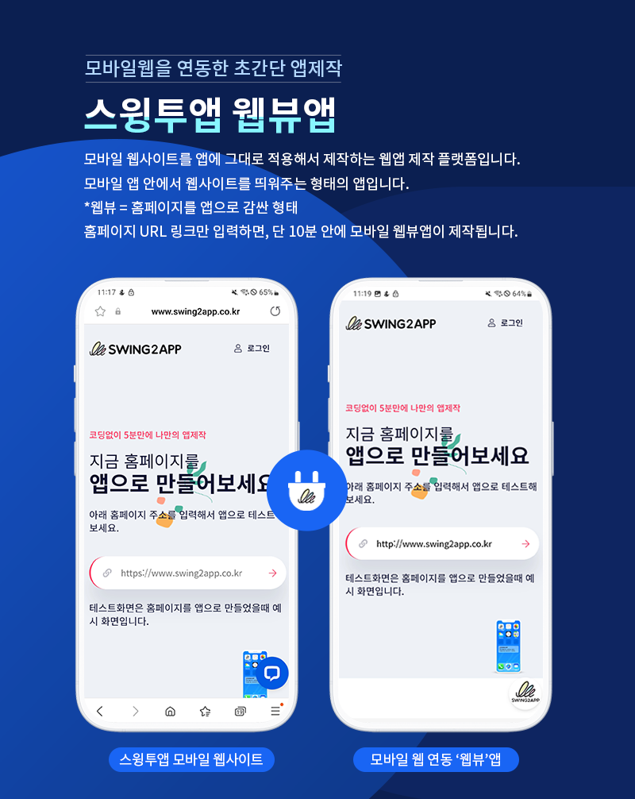
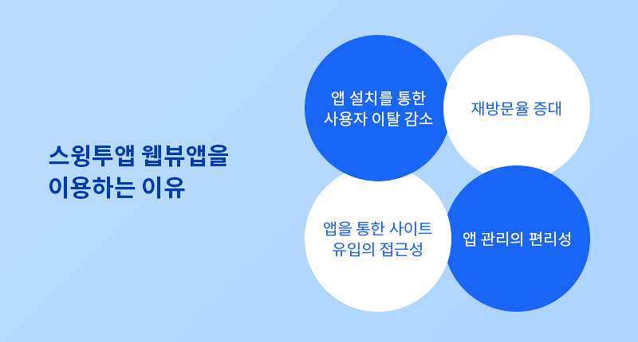
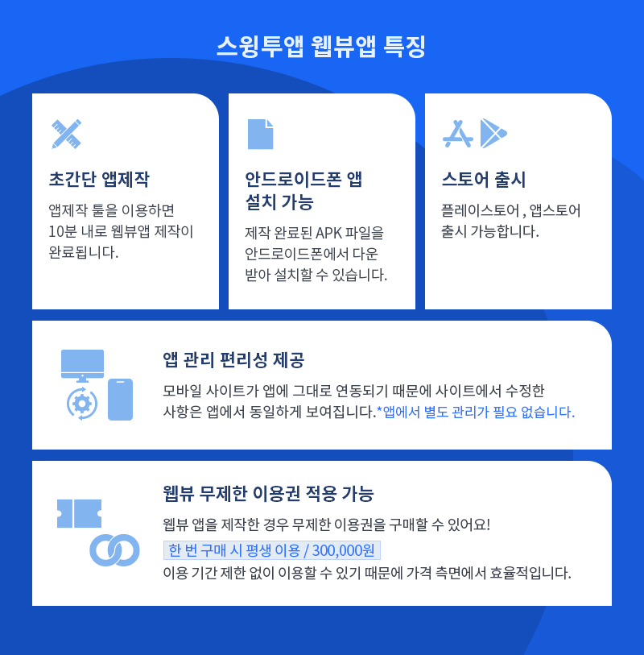

# 스윙투앱 웹뷰앱

<figure><figcaption></figcaption></figure>

## **스윙투앱 웹뷰앱(WebView App) 소개**

<figure><figcaption></figcaption></figure>

**스윙투앱 웹뷰앱**은 기존에 운영 중인 **모바일 웹사이트**를 그대로 앱으로 변환해주는 솔루션입니다.

별도의 앱 개발 없이, 홈페이지 URL만 입력하면 **10분 이내**에 앱을 제작할 수 있어, 빠르고 경제적인 앱 출시가 가능합니다.

웹사이트에 있는 콘텐츠, 기능, UI 그대로 앱에서 구현되며, 앱스토어(Apple App Store)와 구글 플레이스토어(Google Play Store) 등록도 지원합니다.

***

## **웹뷰앱을 이용하는 이유**

<figure><figcaption></figcaption></figure>

#### 1. **모바일 환경에 최적화된 사용자 경험**

* 사용자들은 이제 대부분의 웹사이트를 **스마트폰으로 접속**합니다.
* 하지만 모바일 브라우저에서의 사용은 번거로움이 많습니다.
  * 주소를 매번 입력해야 함
  * 푸시 알림 불가
  * 앱처럼 직관적이지 않음
* **웹앱으로 전환하면** 기존 웹사이트를 앱처럼 실행할 수 있어, **더 편리하고 직관적인 UX 제공**이 가능합니다.

#### 2. **브랜드 노출 효과 및 고객 신뢰도 상승**

* 앱스토어(Play Store, App Store)에 앱을 등록하면, 사용자는 브랜드를 **공식 앱으로 인식**합니다.
* 이는 기업이나 서비스의 **전문성과 신뢰도 상승**으로 이어집니다.
* 홈페이지만 있는 경우보다 **브랜드 충성도와 노출 빈도가 증가**합니다.

#### 3. **홈 화면 바로가기 & 반복 방문 유도**

* 앱으로 설치 시 **홈 화면에 아이콘이 생기므로 접근성이 뛰어남**
* 자주 방문하는 고객은 앱 실행만으로 서비스 접근 가능 → **재방문율 증가**

#### 4. **개발 비용과 유지관리 부담 없이 앱화**

* 기존 웹사이트를 기반으로 하기 때문에, 앱 콘텐츠를 따로 관리할 필요가 없습니다.
* 수정 시 웹만 고치면 앱에도 **자동 반영**되므로 **운영 효율성이 뛰어납니다.**

#### 5. **경쟁사 대비 차별화**

* 동일 업종 내 경쟁사가 웹사이트만 운영하고 있다면,
* 우리는 앱까지 제공하면서 **모바일 시장에서 차별화된 서비스 제공** 가능

***

## **스윙투앱  웹뷰앱 특징**

<figure><figcaption></figcaption></figure>

**1. 모바일 웹사이트 그대로 앱화**

* 기존 웹사이트를 그대로 감싸는 방식(WebView)으로 앱을 제작
* 별도 개발 없이 **웹 콘텐츠가 앱에서 그대로 작동**

**2. 개발 지식 없이 앱 제작 가능**

* 프로그래밍 지식이 없어도 앱 제작 가능
* 홈페이지 주소만 입력하면 **10분 안에 앱 생성**

**3. iOS & Android 동시 지원**

* 안드로이드, 아이폰 모두 앱 제작 가능
* 각각의 스토어에 맞춰 자동 최적화

**4. 스토어 등록 지원**

* 앱스토어, 플레이스토어에 직접 등록하거나 스윙투앱의 **스토어 등록 대행 서비스 이용 가능**

**5. 기기별 최적화**

* 다양한 기기 및 해상도에 맞춘 **반응형 앱 구조**
* 화면 확대/축소, 회전 등도 앱에서 제어 가능

**6. 콘텐츠 자동 연동**

* 웹사이트 수정 시 앱도 자동 업데이트
* 앱 콘텐츠를 따로 관리할 필요 없음

**7. 광고 및 분석 도구 연동**

* 구글 애널리틱스, 페이스북 픽셀, 애드몹 등 연동 가능
* 마케팅 분석과 수익화까지 가능

***

## **웹뷰앱 제작방법**

<figure><figcaption></figcaption></figure>

**STEP1기본정보**

1\) 앱 아이디 입력 \*앱 아이디는 앱의 고유 식별자이며 설정 후에는 변경할 수 없습니다.

2\) 앱 이름 입력

3\) 앱 아이콘 이미지 (1024px\*1024px)

4\) 앱 대기화면 이미지 등록 (2282px\*2282px)

5\) \[저장]버튼 선택

**STEP2 디자인**

1.프로토타입 선택 : 웹뷰전용으로 선택

2.기본 옵션: 당겨서 새로고침, 화면 하단 탑 버튼 배치 여부 체크

3.고급 옵션: 시스템 폰트 사용여부 체크

\*기본옵션과 고급옵션 아무것도 수정하지 않을 경우 기본 셋팅된 스타일로 제작됩니다.

4\)저장 버튼 선택

**STEP3 페이지**

1\)웹사이트 주소 입력

2\)주소설정 : 최초실행 주소 설정 여부 선택

\*최초 실행 주소란 앱에 연결한 웹사이트 외에 앱을 설치하고 처음에만 보여지는 별도 웹페이지를 적용할 수 있습니다.

3\)저장 버튼 선택

**STEP4 앱제작하기**

1\)앱제작하기 버튼 선택

2\)앱제작 팝업창에서 \[제작하기] 버튼을 선택해주세요.

업데이트 표시 옵션은 어떤 것을 선택해도 상관없습니다.

최초 제작시에는 업데이트 창이 뜨지 않기 때문에 어떤 것을 선택해도 무관합니다.

***

## **웹뷰앱 가격정책**

<figure><figcaption></figcaption></figure>

무제한 상품은 총 3가지이며, 출시하고자 하는 플랫폼에 따라 상품 구매가 가능해요.

**\*업로드 티켓 금액 포함**

**(1)앱스토어, 플레이스토어 모두 출시한다면**

✅웹뷰 무제한 유료앱(아이폰+안드로이드)300,000원+플레이스토어 업로드티켓20,000원+앱스토어 업로드티켓20,000원 = 340,000원

**(2)플레이스토어만 출시한다면**

✅웹뷰 무제한 유료앱(안드로이드)160,000원+플레이스토어 업로드티켓20,000원=180,000원

**(3)앱스토어만 출시한다면**

✅웹뷰 무제한 유료앱(아이폰)230,000원+앱스토어 업로드티켓20,000원=250,000원

앱을 장기간 운영할 예정이며, 이용기간 제한 없이 운영하신다면 ‘웹뷰 전용 무제한 유료앱’ 상품을 구매하시기를 권장드립니다.

플레이스토어, 앱스토어 출시 여부에 따라 각각의 플랫폼별 상품 구매가 가능하오니 합리적으로 이용할 수 있습니다.

<figure><figcaption></figcaption></figure>


**웹뷰앱 제작 및 스토어 출시 과정을 한 눈에 보고 싶다면?**

스윙투앱 웹뷰앱 제작방법은 아래 매뉴얼을 보시면 보다 상세하게 확인 가능합니다.

[**웹뷰앱 전체 과정 매뉴얼**](https://help-7.gitbook.io/undefined/manual/v3/webapp/webview)



**웹뷰앱을 스토어에 출시한다면 ‘웹뷰 무제한 유료앱’을 구매해서 출시할 수 있어요.**

상품 상세 내용을 확인해주세요!

[**웹뷰 무제한 유료앱 이용권 보러가기**](https://help-7.gitbook.io/undefined/manual/appmanage/pay/webveiw-unlimited)


